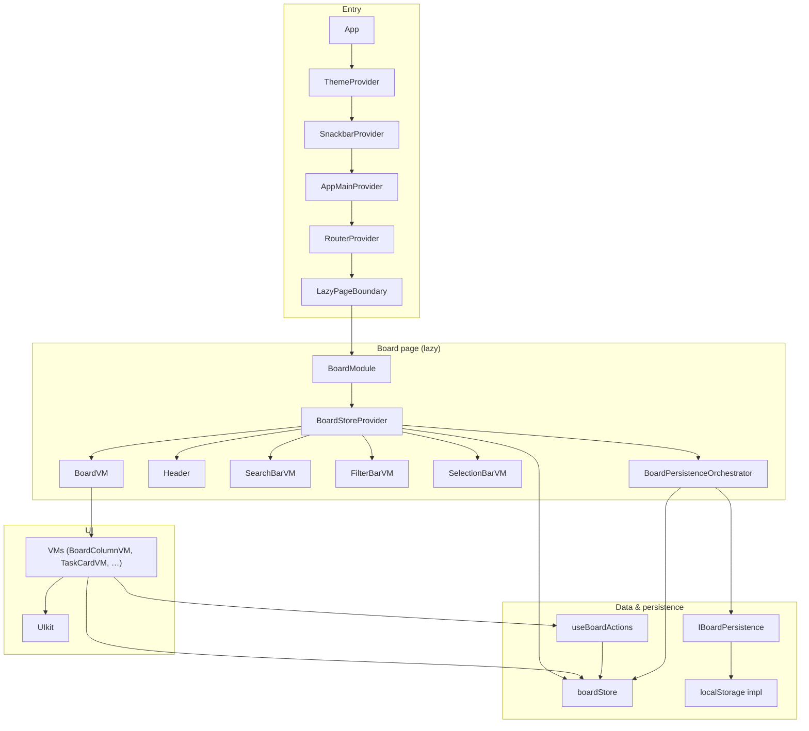

# Pragmatic Task Manager

Responsive **kanban-style todo** — React 19, Vite 7, TypeScript, Zustand. Custom UI; DnD via **@atlaskit/pragmatic-drag-and-drop**.

**Live demo:** [https://69982fa7511b23b08d40c5db--luxury-blancmange-cdd889.netlify.app/](https://69982fa7511b23b08d40c5db--luxury-blancmange-cdd889.netlify.app/)

---

## Features

Columns (add/delete/reorder), tasks (add/edit/remove/complete/reorder/move), search (token-based, highlight), filter (all/completed/incomplete), multi-select and bulk actions, **localStorage** persistence, responsive layout, ErrorBoundary.

---

## Tech stack

React 19, Vite 7, TypeScript 5.9, Zustand (+ Immer, devtools), React Router 7, i18next, notistack, pragmatic-drag-and-drop. No UI libraries.

---

## Quick start

```bash
npm install
npm run dev
```

**http://localhost:5173** · Node.js 20+

| Script | Description |
|--------|-------------|
| `npm run dev` | Dev server |
| `npm run build` | Type-check + build |
| `npm run preview` | Serve build |
| `npm run lint` | ESLint |
| `npm run test` | Vitest |
| `npm run analyze` | Build + bundle visualizer |

---

## Architecture: diagram of connections

One diagram shows **who uses whom**: composition (who renders whom) and data (who reads/writes the store, who talks to persistence).



**In short:** VMs read from **Store** and call **useBoardActions** to change it; they render **UIkit**. **BoardPersistenceOrchestrator** subscribes to the store and calls **IBoardPersistence** (load on mount, debounced save on change). Store does not know about persistence.

---

## Layers (brief)

| Layer | Role | Where |
|-------|------|--------|
| **Presentation** | UI only; VMs read store + actions, render UIkit | `shared/UIkit/`, `pages/…/vm/` |
| **Application** | Actions + persistence hook | `useBoardActions`, `useBoardPersistence` |
| **State** | Single source of truth (columns, tasks, selection, search, UI) | `boardStore` (Zustand slices) |
| **Persistence** | load/save; store stays unaware | `IBoardPersistence`, orchestrator wires it |

---

## Data persistence

- **Contract:** `IBoardPersistence`: `load()` → `ISerializedBoardState | null`, `save(data)`.
- **Store:** `hydrateBoard(payload)` sets columns + tasks; `serializeBoardState(store.getState())` returns `{ columns, tasks }`.
- **Orchestrator** (inside BoardStoreProvider): on mount → `load()` → `hydrateBoard(data)`; on store change → debounce 300 ms → `save(serializeBoardState(...))`. Errors → toasts.
- **Current:** `localStorageBoardPersistence` (one key, shape check on load).

**Backend later:** Add `apiBoardPersistence` implementing `IBoardPersistence` (e.g. GET/PUT `/api/board`), swap it in the orchestrator (or via env/context). Store and app code unchanged.

---

## Optimization

- **Chunks:** react-vendor, react-router, i18n, notistack, vendor, index (initial); BoardModule, zustand, pragmatic-dnd (lazy with board). See `vite.config.ts` → `manualChunks`.
- **Lazy:** BoardModule = `lazy(import(...))` → smaller initial bundle.
- **Tree-shaking:** Named imports; pragmatic-dnd by subpath; no unused deps.
- **Inspect:** `npm run analyze`.

---

## Project structure

```
src/
├── providers/boardStoreProvider/   # BoardStoreProvider, Orchestrator, boardStore (slices), hooks
├── pages/boardModule/              # BoardModule, vm/, hooks/, helpers/
├── shared/UIkit/                   # Button, Input, Select, Card, Checkbox, DropdownMenu
├── components/                     # ErrorBoundary, LazyPageBoundary, Header, …
├── theme/, i18n/, helpers/
├── App.tsx, main.tsx, appRoutes.config.tsx
└── index.css
```

---

## Theme & code style

Theme: `src/theme/appPalette.ts` → CSS vars on `document.documentElement`. Use `var(--app-*)`.

Code: ESLint + TypeScript strict; `FC<IProps>`; interfaces in `*.interface.ts` (names with `I`); path aliases `@/`, `@shared/*`, etc.; providers via `buildProvidersTree`; VMs under `pages/…/vm/`, UI under `shared/UIkit/`.
